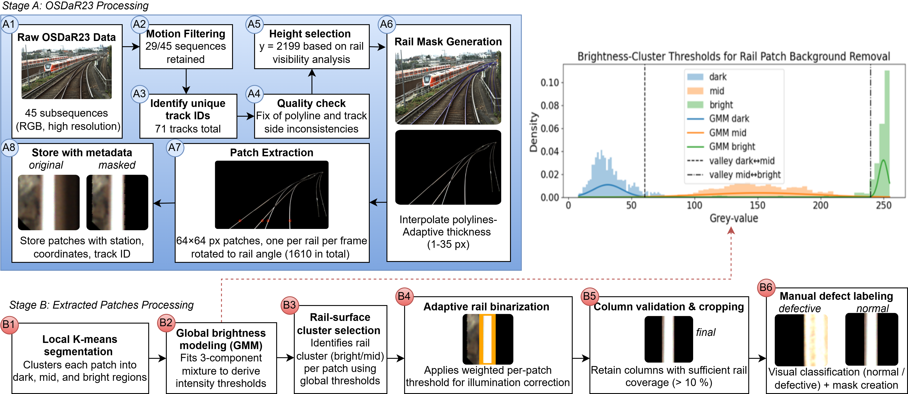
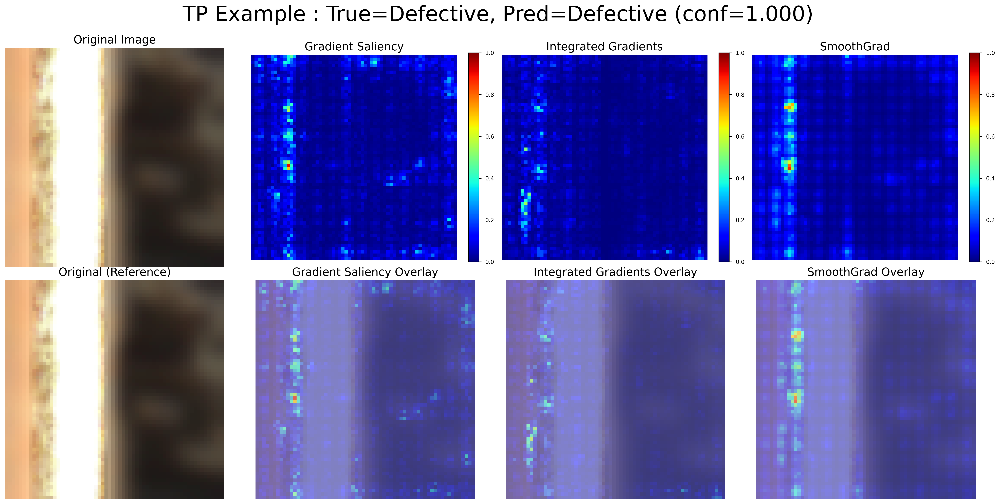

# Rail Track Defect Detection from ATO Cameras

## Description

This repository contains the implementation for my MSc thesis: **"Leveraging Autonomous Train Operation Cameras for Rail Track Monitoring"**.

The project develops an end-to-end computer vision system for detecting rail surface defects using forward-facing cameras from autonomous train operation (ATO) systems. The system aims to provide an early-warning mechanism for rail infrastructure monitoring and includes novel preprocessing, novel stratified data splitting strategy, transformer-based classification, and sequence-aware post-processing.

The full thesis is available here: https://theses.liacs.nl/pdf/2025-2026-MiltiadousMMyriana.pdf
## Dataset

The project uses the **OSDAR23** dataset, which contains rail track images from Hamburg stations. From this, a new dataset is extracted with rail track patches which is used for this work.

## Setup Instructions:
### Prerequisites
- Install [Miniconda](https://docs.conda.io/en/latest/miniconda.html) or Anaconda
- For GPU acceleration: NVIDIA GPU with CUDA 11.8 compatible drivers
### Steps
1. Clone the repository and set the working directory
```bash
git clone https://github.com/mmiltiadous/ATO-Track-Inspector
cd ATO-Track-Inspector
```
2. Download the OSDAR23 dataset from: [https://data.fid-move.de/dataset/osdar23](https://data.fid-move.de/dataset/osdar23) 
3. Extract the downloaded data and place each folder (e.g., 1_calibration_1.1, 1_calibration_1.2, etc.) in: `./rail_data/DB/`
4. Set up the virtual environment using conda:
```bash
conda env create -f environment.yml
conda activate dbthesis_env
```
5. Run the notebooks in the numerical order presented in the Pipeline Workflow section (Step 1→ Step 8) to reproduce the project.

## Quick Access for Experiments
The necessary data for experiments (including labels and masks for defects) are created after running Steps 1 and 2. Those are in the sequential/ folder. For directly running experiments, you can skip Steps 1 and 2 and start from Step 3, which splits the created data. Then, Steps 4-8 include the different experiments.


##  Pipeline Workflow

**Preprocessing Overview:**



### Step 1. **Data Preparation & Preprocessing** (A1 - A8, B1 - B5)
**`AnalyzeAndPreprocessOSDAR23_1.ipynb`**  
- Analyzes dataset structure and filters irrelevant data
- Corrects metadata inconsistencies
- Masks rail tracks and crops patches with black background
- Extracts patches per frame/track (optionally multiple patches per track for larger datasets)
- Applies all 6 preprocessing pipelines described in the paper

### Step 2. **Labeling & Mask Creation** (B6)
**`Create_labels_masks_2.ipynb`**  
- Provides functions to connect patches with source images using filename patterns
- Implements labeling functions for defect annotation
- Creates binary masks for defect regions
- Organizes labeled data into structured folders

### Step 3. Data Splitting & Validation

**`splitData_inspectResults_3.ipynb`**

Implements the proposed group-aware data splitting algorithm based on station and sequence information. For each preprocessing variant (`original_data_folds`, `black_data_folds`, `blackclahe_data_folds`, `blur_data_folds`, `blurclahe_data_folds`, and `blurclahebw_data_folds`), two separate split configurations are generated:

* **Outer split**: `fold_0` validation set is reserved for the final testing stage (**Experiment 5**).
* **Inner split**: used for **Experiments 1–4**.

Each split contains five folds (`fold_0`–`fold_4`). Within every fold, the following directory structure is created:

```text id="w7v9rw"
train/
├── good/
└── defective/

train_masks/
├── defective/

val/
├── good/
└── defective/

val_masks/
├── defective/
```

The `train/` and `val/` directories contain images separated into `good` and `defective` classes, while `train_masks/` and `val_masks/` contain the corresponding segmentation masks for defective samples.

The notebook also validates split integrity and prevents data leakage between training, validation, and test sets.


### Step 4. **Experiments 1 & 2: Preprocessing Analysis**
**`Experiment1_Experiment2.ipynb`**  
- **Experiment 1**: Compares 6 preprocessing pipelines using AUPRC metrics
- **Experiment 2**: Evaluates the impact of different random seeds on cross-validation splits.
- Saves performance metrics and generates plots
- Analyzes sensitivity to data splits

### Step 5. **Experiment 3: Model Comparison**
**`Experiment3.ipynb`**  
- Implements DeiT-Small (both distilled and standard variants)
- Compares against ResNet-18 (results imported from Experiment 2) and PatchCore (unsupervised baseline)
- Analyzes results from all three models and creates comparison plots
- Demonstrates transformer superiority for global context understanding

> **Note:** The results of Experiment 3 are provided in the results_experiment3/ directory. Therefore, the sections Inspect Results, Overall Metrics for the Best Model (DeiT-S) Selected for Tuning, Ensemble Metrics, and Plots of **`Experiment3.ipynb`** can be executed directly to reproduce the evaluation summaries and visualizations without rerunning the experiments.

#### Running PatchCore Guidelines

To run PatchCore, follow the instructions provided in the official repository: [PatchCore Official Repository](https://github.com/amazon-science/patchcore-inspection?utm_source=chatgpt.com). The PatchcoreFileReplacement folder of this repo contains a modified version of the original run_patchcore.py file. All changes made to the original implementation are explicitly marked in the code using the following annotations: # MODIFICATION {i} START -- # MODIFICATION {i} END, where {i} is the identifier of a specific modification.

Each preprocessing variant should be organized into a separate dataset directory following the PatchCore format:

```text id="4m3t2g"
dataset_name/
├── train/
├── test/
└── ground_truth/
```

The directory structure should be organized as follows:

* `train/good/` : contains all non-defective training samples.
* `test/good/` : contains non-defective validation samples.
* `test/defective/` : contains defective validation samples.
* `ground_truth/defective/` : contains segmentation masks corresponding to defective validation samples.

For each fold (`fold_i`), the dataset is constructed using the generated split folders:

* The contents of `train/good/` are taken from `fold_i/train/good/`.
* The contents of `test/good/` and `test/defective/` are taken from `fold_i/val/good` and `fold_i/val/defective` respectively.
* The contents of `ground_truth/defective/` are taken from `fold_i/val_masks/defective`.

A separate PatchCore-compatible dataset directory must be created for every fold (`fold_0`–`fold_4`), since each fold represents a different train/validation split used during cross-validation experiments.

### Step 6. **Experiment 4: Sequential Refinement**
**`Experiment4.ipynb`**  
- Applies sequence-aware post-processing methods:
  - Confidence-weighted smoothing
  - Isolated false positive removal
  - Bidirectional LSTM refinement
- Compares heuristic vs. learned refinement approaches
- Generates thesis plots for sequential analysis

### Step 7. **Experiment 5: Final Evaluation**
**`Experiment5.ipynb`**  
- Performs hyperparameter tuning on validation set
- Evaluates final pipeline on completely held-out test set
- Reports precision, recall, F1-score, and AUPRC
- Demonstrates near-perfect performance on unseen data

### Step 8. **Experiment 6: Explainability Analysis**
**`Experiment6.ipynb`**  
- Applies gradient-based attribution methods
- Analyzes True Positives, True Negatives, and False Positives
- Identifies failure modes and model attention patterns
- Provides visual justifications for model decisions
> **Note:** This file is divided into two sections. The first section analyses the results from all three models in Experiment 3, while the second analyses the results of the final model from Experiment 5. The results_experiment6_xai folder contains all saliency maps generated using the code presented in the second section. 

**Example saliency map:**


